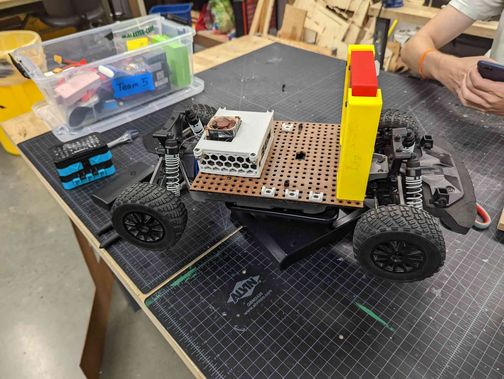
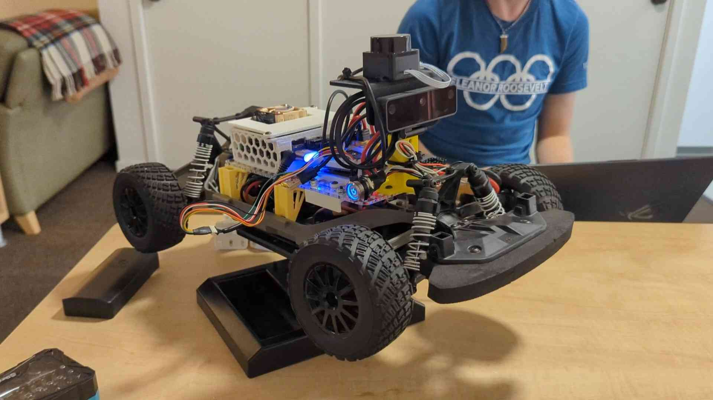

# ECE/MAE 148 Fall 2022 Team 5

## Project Team Members

 - **Marfred Barrera**: MAE
 - **Matthew Gross**: ECE/CSE
 - **Paul Guyett**: MAE
 - **Andrew MacPhee**: ECE

## 3 Autonomous Laps: DonkeyCar

## 3 Autonomous Laps: OpenCV (Python)

## Project Overview

This project focuses on Visual Velocity Checkpoints (VVCs) using AprilTags. While autonously navigating a track, the car's camera can detect an AprilTag which represents an integer. The program then takes this integer and uses a predefined dictionary to map that integer to one of the velocity curves created using the track. It then carries out whatever curve the tag represents, in our case being a slow constant speed, a fast constant speed, or a complete stop. This is accomplished on the physical car by using functions from the OpenCV and Apriltag libraries on the image output from the camera, and the results from calculating velocity are sent to the motor and servo using pyVESC.

## Car Components

## Electrical Schematic

## Implementation

**Software and Hardware List**
- Jetson Nano with microSD card
- OAKD Camera
- Lidar (unused)
- Controller for training the DonkeyCar laps
- OpenCV
- Apriltag (both the physical tags and the library)
- VESC

**Source code**

- [Our Github Repo](https://github.com/maarongross/148-final-project)

## Results

In the end, our team was able to successfully get our car to drive autonomously, recognize AprilTags, and vary its velocity based on the information encoded on it. We were unable to implement more complex veloctiy curves besides constant curves, though with more time this and much more is possible. 

## Gantt Chart
- **insert gantt chart pic**

## Final Project Demonstration

## Potential Improvements

- Implement more complex velocity curves
- Eliminate requirement of inputting the approximate distance for which an AprilTag will run
- Sequential order to checkpoints
- AprilTags encoded with steering inputs as well as velocity curves

[Final Presentation](https://docs.google.com/presentation/d/1rmymGUZG53cA7HSs-WxR7bJfRqua__aouMMzhB_43e0/edit#slide=id.p)
