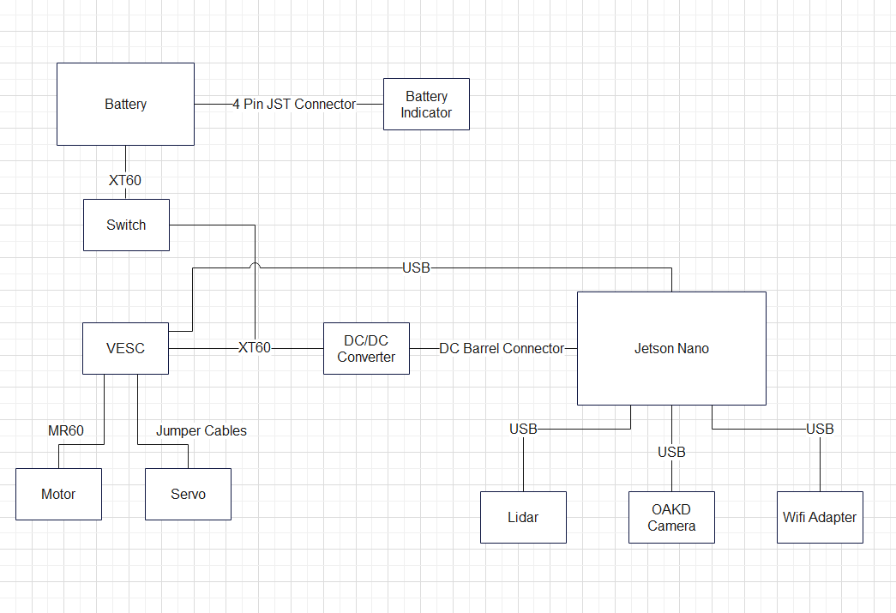

# ECE/MAE 148 Fall 2022 Team 5

## Project Team Members
___
 - **Marfred Barrera**: MAE
 - **Matthew Gross**: ECE/CSE
 - **Paul Guyett**: MAE
 - **Andrew MacPhee**: ECE

## 3 Autonomous Laps: DonkeyCar
___

## 3 Autonomous Laps: OpenCV (Python)

___

## Project Overview
___
This project focuses on visual velocity checkpoints using AprilTags. While autonously navigating a track, the car's camera can detect an AprilTag with an encoded velocity curve that the car then carries out. First, AprilTag recognition, experimentation, and implementaiton was done on a kinematics-based Python simulation. Then, the bulk of the simulation was transferred onto the physical car. This is done using openCV and pyVESC libraries, as well as an OAKD camera, Jetson Nano, and VESC. 

## Car Components
___

**insert car before-and-after pics**

## Electrical Schematic
___

## Implementation
___
**Software and Hardware List**
- Jetson Nano
- Camera
- MicroSD card
- OpenCV
- VESC

**Source code**

- [Our Github Repo](https://github.com/maarongross/148-final-project)

## Results
___

In the end, our team was able to successfully get our car to drive autonomously, recognize AprilTags, and vary its velocity based on the information encoded on it. We were unable to implement more complex veloctiy curves besides constant curves, though with more time this and much more is possible. 

## Gantt Chart
- **insert gantt chart pic**

## Final Project Demonstration
___

## Potential Improvements

___

- Implement more complex velocity curves
- Eliminate requirement of inputting the approximate distance for which an AprilTag will run
- Sequential order to checkpoints
- AprilTags encoded with steering inputs as well as velocity curves

___

[Final Presentation](https://docs.google.com/presentation/d/1rmymGUZG53cA7HSs-WxR7bJfRqua__aouMMzhB_43e0/edit#slide=id.p)
